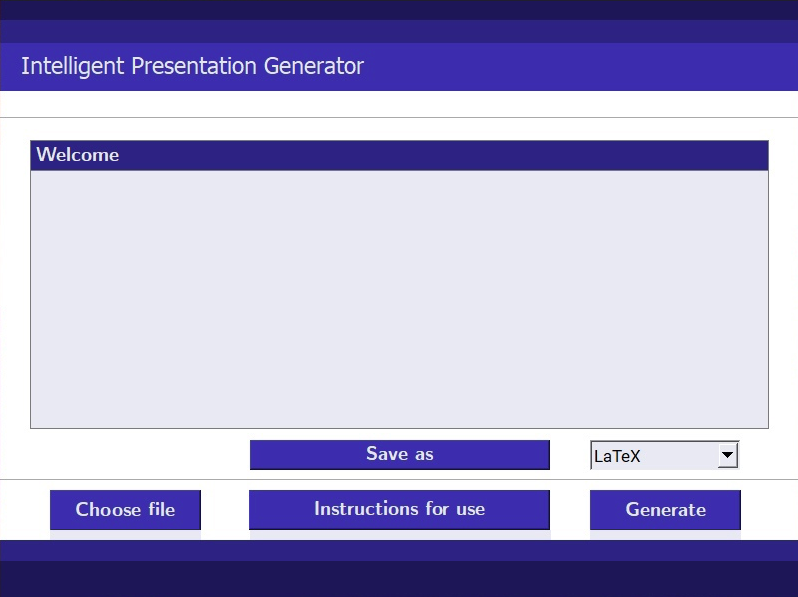

---

##### Links

- [Terms of reference](https://github.com/kisnikser/Intelligent-Presentation-Generator/blob/main/terms_of_reference/terms_of_reference.pdf) 
- [Code](https://github.com/kisnikser/Intelligent-Presentation-Generator)

---

##### Abstract

The user is faced with the task of creating a presentation in a short time.
The program allows you to save a lot of time and automate this process.
Using the user interface, it is possible to specify the source (printed input or text file). 
Then, depending on the user's software, the method of generating the presentation is selected --- $\LaTeX$ or by the internal interface of the application.
At the output, the user receives a ready-made presentation, each slide of which corresponds to some topic highlighted in a text file using machine learning.
We use top modeling to determine the number of topics in a document and then identify the most relevant terms in those topics.

---

##### Figure 1: Overview

