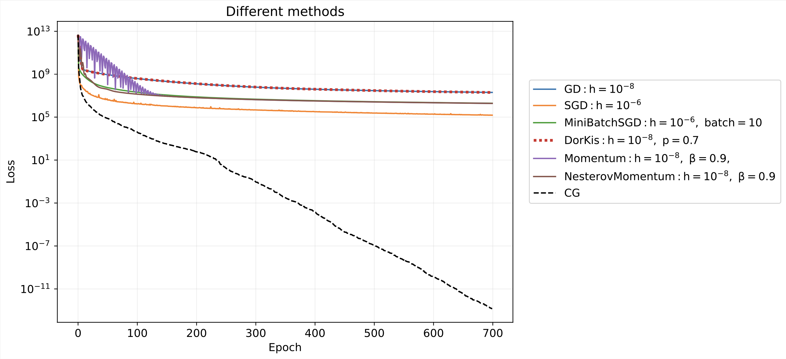

---

##### Links

- [Code](https://github.com/kisnikser/Optimization-Methods/blob/main/main.ipynb)
- [Slides](https://github.com/kisnikser/Optimization-Methods/blob/main/pres_for_opt.pdf)

---

##### Abstract

The purpose of this work is to compare different methods for solving high-dimensional linear regression problems. It is proposed to investigate various methods of accelerated and adaptive gradient descent, the conjugate gradient method, SGD and Mini-Batch SGD. The computational experiment is carried out on the sample presented in [this paper](https://www.nature.com/articles/s41597-022-01173-0). The dataset includes fMRI recordings of 30 participants aged 7 to 47 years old, obtained while they were watching a short audiovisual film.

---

##### Figure 1: Overview

