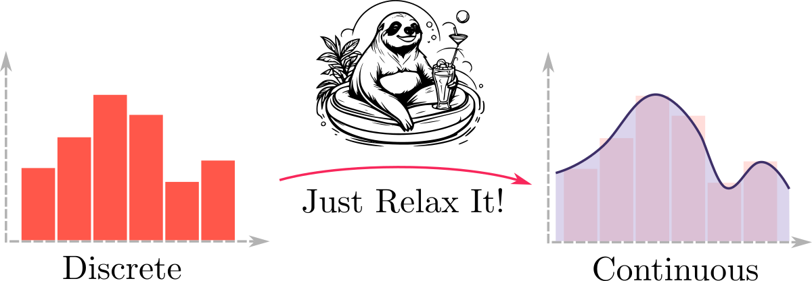
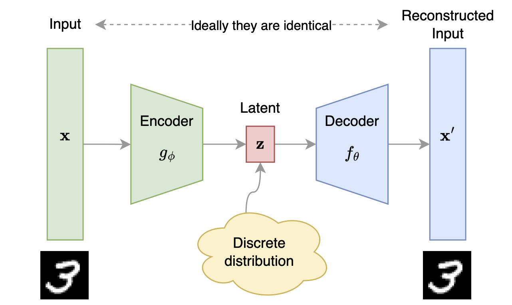
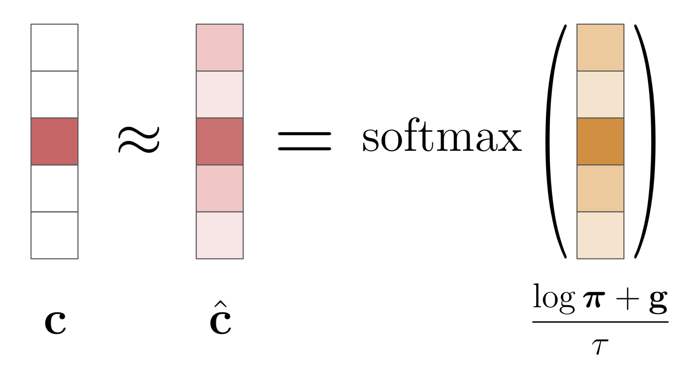
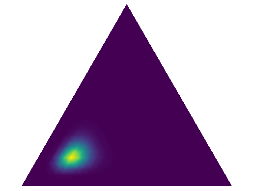
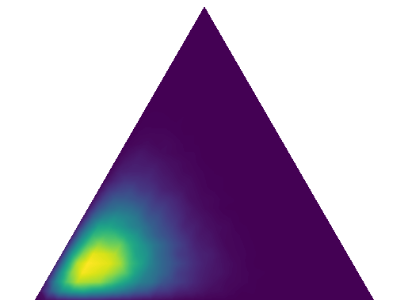
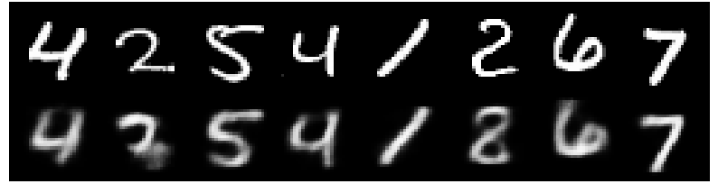
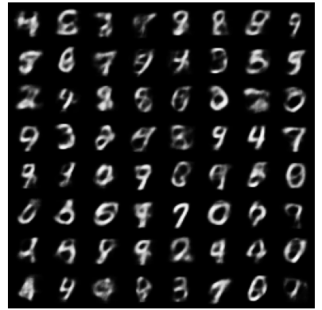

In this blog-post we present our Python library ["Just Relax It"](https://github.com/intsystems/relaxit) (or `relaxit`) designed to streamline the optimization of discrete probability distributions in neural networks, offering a suite of advanced relaxation techniques compatible with PyTorch.

## Introduction 

Rapid advancement of generative models, such as Variational Autoencoders (VAEs) and Diffusion Models, has driven the development of relevant mathematical tools. 
Any generative model contains some source of randomness to make new objects.
This randomness is represented by a probability distribution, from which random variables are sampled.
Therefore, training a generative model often boils down to optimizing the parameters of this distribution.

Pioneering generative models typically work with **continuous** distributions like the Normal distribution.
However, for some modalities, such as texts or graphs, it is more natural to use **discrete** distributions — Bernoulli, Categorical, etc.

Thus, we present our new Python library ["Just Relax It"](https://github.com/intsystems/relaxit) that combines the best techniques for relaxing discrete distributions (we will explain what that means later) into an easy-to-use package. And it is compatible with PyTorch!

We start with a basic Variational Autoencoder (VAE) example that shows how parameter optimization typically happens for continuous distributions, then we move on to the case of discrete distributions. 
After that, we overview relaxation methods used in our library and provide a demo of training a VAE with discrete latent variables.



We assume that you are already familiar with the concept of a Variational Autoencoder (VAE), at least at the level that it consists of two parts: an encoder and a decoder, and tries to approximate the distribution $p(\mathbf{x})$ of data $\mathbf{x}$ using latent variables $\mathbf{z}$. If this is not the case, then we recommend that you to read a [blog-post](https://lilianweng.github.io/posts/2018-08-12-vae/) by Lilian Weng.

<figcaption>Fig. 1. Illustration of Variational Autoencoder (VAE) architecture. </figcaption>

The original VAE ([Kingma & Welling, 2014](https://arxiv.org/abs/1312.6114)) has two main parts:

1. **Encoder** $q_{\boldsymbol{\phi}}(\mathbf{z}|\mathbf{x})$: A neural network $g_{\boldsymbol{\phi}}(\mathbf{x})$ that outputs parameters of the latent Gaussian distribution.
2. **Decoder** $p_{\boldsymbol{\theta}}(\mathbf{x}|\mathbf{z})$: A neural network $f_{\boldsymbol{\theta}}(\mathbf{z})$ that outputs parameters of the sample distribution (usually Gaussian or Bernoulli).

Training a VAE involves maximizing the ELBO (evidence lower bound) with respect to the encoder and decoder parameters: 

$$
\mathcal{L}\_{\boldsymbol{\phi}, \boldsymbol{\theta}}(\mathbf{x}) = \mathbb{E}\_{q_{\boldsymbol{\phi}}(\mathbf{z}|\mathbf{x})} \log p_{\boldsymbol{\theta}}(\mathbf{x}|\mathbf{z}) - KL(q_{\boldsymbol{\phi}}(\mathbf{z}|\mathbf{x}) \| p(\mathbf{z})) \to \max_{\boldsymbol{\phi}, \boldsymbol{\theta}}.
$$

During the **M-step**, we derive an unbiased estimator for the gradient $\nabla_{\boldsymbol{\theta}}\mathcal{L}_{\boldsymbol{\phi}, \boldsymbol{\theta}}(\mathbf{x})$:

$$
\begin{aligned}
\nabla\_{\boldsymbol{\theta}}\mathcal{L}\_{\boldsymbol{\phi}, \boldsymbol{\theta}}(\mathbf{x})
&= \textcolor{blue}{\nabla\_{\boldsymbol{\theta}}} \int q\_{\boldsymbol{\phi}}(\mathbf{z}|\mathbf{x}) \log p\_{\boldsymbol{\theta}}(\mathbf{x}|\mathbf{z}) d\mathbf{z} \\\
&= \int q\_{\boldsymbol{\phi}}(\mathbf{z}|\mathbf{x}) \textcolor{blue}{\nabla\_{\boldsymbol{\theta}}} \log p\_{\boldsymbol{\theta}}(\mathbf{x}|\mathbf{z}) d\mathbf{z} \\\
&\approx \nabla\_{\boldsymbol{\theta}} \log p\_{\boldsymbol{\theta}}(\mathbf{x}|\mathbf{z}^*), \quad \mathbf{z}^\* \sim q\_{\boldsymbol{\phi}}(\mathbf{z}|\mathbf{x}),
\end{aligned}
$$

where the last approximation uses Monte-Carlo sampling.

However, during the **E-step**, getting an unbiased estimator for the gradient $\nabla\_{\boldsymbol{\phi}}\mathcal{L}\_{\boldsymbol{\phi}, \boldsymbol{\theta}}(\mathbf{x})$ is tricky because the density function $q_{\boldsymbol{\phi}}(\mathbf{z}|\mathbf{x})$ depends on $\boldsymbol{\phi}$. This makes Monte-Carlo estimation impossible:

$$
\begin{aligned}
\nabla\_{\boldsymbol{\phi}}\mathcal{L}\_{\boldsymbol{\phi}, \boldsymbol{\theta}}(\mathbf{x})
&= \textcolor{blue}{\nabla\_{\boldsymbol{\phi}}} \int q\_{\boldsymbol{\phi}}(\mathbf{z}|\mathbf{x}) \log p\_{\boldsymbol{\theta}}(\mathbf{x}|\mathbf{z}) d\mathbf{z} - \nabla\_{\boldsymbol{\phi}} KL(q\_{\boldsymbol{\phi}}(\mathbf{z}|\mathbf{x}) \| p(\mathbf{z})) \\\
&\textcolor{red}{\neq} \int q\_{\boldsymbol{\phi}}(\mathbf{z}|\mathbf{x}) \textcolor{blue}{\nabla\_{\boldsymbol{\phi}}} \log p\_{\boldsymbol{\theta}}(\mathbf{x}|\mathbf{z}) d\mathbf{z} - \nabla\_{\boldsymbol{\phi}} KL(q\_{\boldsymbol{\phi}}(\mathbf{z}|\mathbf{x}) \| p(\mathbf{z})), \\\
\end{aligned}
$$

This is where the **reparameterization trick** comes in. Assuming $q_{\boldsymbol{\phi}}(\mathbf{z}|\mathbf{x})$ to be Gaussian, we reparameterize the encoder's outputs:

$$
\begin{aligned}
\nabla\_{\boldsymbol{\phi}} \int \textcolor{blue}{q\_{\boldsymbol{\phi}}(\mathbf{z}|\mathbf{x})} \log p\_{\boldsymbol{\theta}}(\mathbf{x}|\textcolor{olive}{\mathbf{z}}) d\mathbf{z}
&= \int \textcolor{blue}{p(\boldsymbol{\epsilon})} \nabla\_{\boldsymbol{\phi}} \log p\_{\boldsymbol{\theta}}(\mathbf{x}|\textcolor{olive}{\mathbf{g}\_{\boldsymbol{\phi}}(\mathbf{x}, \boldsymbol{\epsilon})}) d\boldsymbol{\epsilon} \\\
&\approx \nabla\_{\boldsymbol{\phi}} \log p\_{\boldsymbol{\theta}}(\mathbf{x}|\textcolor{olive}{\boldsymbol{\sigma}\_{\boldsymbol{\phi}}(\mathbf{x})} \odot \textcolor{blue}{\boldsymbol{\epsilon}^\*} + \textcolor{olive}{\boldsymbol{\mu}\_{\boldsymbol{\phi}}(\mathbf{x})}), \quad \textcolor{blue}{\boldsymbol{\epsilon}^*} \sim \mathcal{N}(0, \mathbf{I}),
\end{aligned}
$$

so we move the randomness from $\mathbf{z} \sim q_{\boldsymbol{\phi}}(\mathbf{z}|\mathbf{x})$ to $\boldsymbol{\epsilon} \sim p(\boldsymbol{\epsilon})$ and use a deterministic transform $\mathbf{z} = \mathbf{g}\_{\boldsymbol{\phi}}(\mathbf{x}, \boldsymbol{\epsilon})$ to get an unbiased gradient. Moreover, the normal assumptions for $q\_{\boldsymbol{\phi}}(\mathbf{z}|\mathbf{x})$ and $p(\mathbf{z})$ allow us to compute $KL$ analytically and thus calculate the gradient $\nabla\_{\boldsymbol{\phi}}KL(q\_{\boldsymbol{\phi}}(\mathbf{z}|\mathbf{x}) \| p(\mathbf{z}))$.

This example highlights the reparameterization trick, crucial for getting unbiased gradient estimates in continuous latent space VAEs. However, discrete representations $\mathbf{z}$ are often more natural for modalities like texts or graphs, leading us to **discrete VAE latents**. Therefore:

- Our encoder should output a discrete distribution.
- We need an analogue of the reparameterization trick for discrete distributions.
- Our decoder should input discrete random variables.

The classical solution for discrete variable reparameterization is **Gumbel-Softmax** ([Jang et al. 2017](https://arxiv.org/abs/1611.01144)) or **Concrete distribution** ([Maddison et al. 2017](https://arxiv.org/abs/1611.00712)). This is one distribution proposed in parallel by two research groups.

#### Gumbel Distribution

$$ g \sim \mathrm{Gumbel}(0, 1) \quad \Leftrightarrow \quad g = -\log( - \log u), \quad u \sim \mathrm{Uniform}[0, 1] $$

#### Theorem (Gumbel-Max Trick)

Let $g_k \sim \mathrm{Gumbel}(0, 1)$ for $k = 1, \ldots, K$. Then a discrete random variable

$$ c = \arg\max_k [\log \pi_k + g_k] $$

has a categorical distribution $c \sim \mathrm{Categorical}(\boldsymbol{\pi})$.

- We can sample from the discrete distribution using Gumbel-Max reparameterization.
- Parameters and random variable sampling are separated (reparameterization trick).
- **Problem:** The $\arg\max$ operation is non-differentiable. 

To overcome the above problem, the authors propose to consider **one-hot Categorical distribution**, that is simply replace random variable $c \in \\{1, \ldots, K\\}$ with a random vector $\mathbf{c} \in \\{0, 1\\}^{K}$, such that
$$ c = k \quad \Leftrightarrow \quad \mathbf{c}_k = 1. $$

#### Gumbel-Softmax Relaxation

$$ \hat{\mathbf{c}} = \mathrm{softmax}\left( \frac{\log \boldsymbol{\pi} + \mathbf{g}}{\tau} \right) $$

Further, they **relax** $\arg\max$ operation into $\mathrm{softmax}$, introducing a temperature parameter $\tau > 0$. 
As temperature $\tau \to \infty$, Gumbel-Softmax distribution $\mathrm{GS}(\boldsymbol{\pi}, \tau)$ becomes more uniformly distributed (consider the analogy with melting ice).
In contrast, as temperature limits to zero, that is $\tau \to 0$, the distribution becomes more and more similar with initial one — defined with $\arg\max$.

<figcaption>Fig. 2. Illustration of Gumbel-Softmax trick. </figcaption>

The **key idea** is that $\mathrm{softmax}$ is differential function, which allows us to do backward pass in neural networks!
Such technique is called **relaxation**.



### Other relaxation methods

We talked about one example of a relaxation for VAE with discrete latents — Gumbel-Softmax. 
There are other ways too. 
They give more flexible and better estimates of gradients. 
The rest of the blog-post is about these other relaxation methods. 

## Package Contents

In this section, we shortly discuss each of the methods implemented in our Python library ["Just Relax It"](https://github.com/intsystems/relaxit).
Firstly, we generalize all relaxation methods into the following problem formulation (see [Introduction](#introduction) for details): 

> Given discrete random variable $\mathbf{c} \sim p_{\boldsymbol{\phi}}(\mathbf{c})$, estimate the gradient w.r.t. $\boldsymbol{\phi}$ of the expected value of some deterministic function $f(\mathbf{c})$, using reparameterization trick with relaxation $\mathbf{c} \approx \hat{\mathbf{c}}(\mathbf{z}, \tau)$, where $\mathbf{z} \sim p(\mathbf{z})$ and $\tau > 0$ is a temperature parameter. In other words,
$$
    \nabla\_{\boldsymbol{\phi}} \mathbb{E}\_{p_{\boldsymbol{\phi}}(\mathbf{c})} f(\mathbf{c}) \approx \mathbb{E}\_{p(\mathbf{z})} \left[ \nabla\_{\boldsymbol{\phi}} f(\hat{\mathbf{c}}(\mathbf{z}, \tau)) \right].
$$

 

This method relaxes **Bernoulli** random variable $c \sim \mathrm{Be}(\pi)$.
The idea is to clip a Gaussian random variable onto $(0, 1)$ and tune the mean $\mu$ and scale $\sigma$ instead of $\pi$:
$$
\begin{aligned}
\epsilon &\sim \mathcal{N}(0, 1),\\\
z &= \sigma \cdot \epsilon + \mu,\\\
\hat{c} &= \min (1, \max (0, z)),
\end{aligned}
$$
where $\mu$ is trainable and $\sigma$ is fixed during training.



 

This method relaxes **Bernoulli** random variable $c \sim \mathrm{Be}(\pi)$.
It is inspired by [Relaxed Bernoulli](#relaxedbernoulli), but uses another random variable to clip onto $(0, 1)$ — Gumbel-Softmax.
Moreover, they additionally "stretch" it from $(0, 1)$ to the wider interval $(a, b)$, where $a < 0$ and $b > 0$ as follows:
$$
\begin{aligned}
z &\sim \mathrm{GS}(\pi, \tau),\\\
\tilde{z} &= (b - a) \cdot z + a,\\\
\hat{c} &= \min (1, \max (0, \tilde{z})),
\end{aligned}
$$
This method applies hard-sigmoid technique to make two delta peaks at zero and one.



 

This method relaxes **Bernoulli** random variable $c \sim \mathrm{Be}(\pi)$.
In order to achieve gradient flow through distribution parameter $\pi$, this method replaces the gradient w.r.t. $c$ with the gradient of a continuous relaxation $\pi$.
Other words, it can be formulated using `torch` [notation](https://pytorch.org/docs/stable/generated/torch.Tensor.detach.html) as follows:
$$
\hat{c} = \pi + (c - \pi)\verb|.detach()|.
$$
It means that on the **forward pass** $\hat{c} = c$, but on the **backward pass** $\hat{c} = \pi$.



 

This method relaxes **Bernoulli** random variable $c \sim \mathrm{Be}(\pi)$ by the following:
$$
\begin{aligned}
p &= \sigma(a), \\\
b &\sim \mathrm{Be}(\sqrt{p}), \\\
\hat{c} &= b \sqrt{p},
\end{aligned}
$$
where $a$ is a parameter of this distribution.



 

This method relaxes **multivariate Bernoulli** random variable $\mathbf{c} \sim \mathrm{MultiBe}(\boldsymbol{\pi}, \mathbf{R})$.

> Multivariate Bernoulli distribution assumes that each component $c_{k}$ can be correlated with others.
> It can be constructed via Gaussian copula $C_{\mathbf{R}}$ ([Nelsen, 2007](https://link.springer.com/book/10.1007/0-387-28678-0)):
$$
    C_{\mathbf{R}}(u_1, \ldots, u_p) = \Phi_{\mathbf{R}}(\Phi^{-1}(u_1), \ldots, \Phi^{-1}(u_p)),
$$
> where $\Phi_{\mathbf{R}}$ is the joint CDF of a multivariate Gaussian distribution with correlation matrix $\mathbf{R}$, and $\Phi^{-1}$ is the inverse CDF of the standard univariate Gaussian distribution. Each component is defined as follows:
$$
    c_{k} = \begin{cases} 1, \quad u_k \leq \pi_k,\\\ 0, \quad u_k > \pi_k. \end{cases}
$$

Relaxation is applied as follows:
$$
    \hat{\mathbf{c}} = \sigma \left( \frac{1}{\tau} \left( \log \frac{\mathbf{u}}{1 - \mathbf{u}} + \log \frac{\boldsymbol{\pi}}{1 - \boldsymbol{\pi}} \right) \right),
$$
where $\sigma(x) = (1 + \exp(-x))^{-1}$ is a sigmoid function, and $\tau$ is a temperature hyperparameter.



 

This method relaxes **Categorical** random variable $\mathbf{c} \sim \mathrm{Cat}(\boldsymbol{\pi})$.
The idea is to transform Gaussian noise $\boldsymbol{\epsilon}$ through invertible transformation $g(\cdot, \tau)$ with temperature $\tau$ onto the simplex:
$$
\begin{aligned}
\boldsymbol{\epsilon} &\sim \mathcal{N}(0, \mathbf{I}),\\\
\mathbf{z} &= \boldsymbol{\sigma} \odot \boldsymbol{\epsilon} + \boldsymbol{\mu},\\\
\hat{\mathbf{c}} &= g(\mathbf{z}, \tau) = \mathrm{softmax}\_{++}(\mathbf{z/\tau}),
\end{aligned}
$$
where the latter function remains invertible via introduction $\delta > 0$ as follows:
$$
    \mathrm{softmax}\_{++}(\mathbf{z/\tau}) = \frac{\exp(\mathbf{z}/\tau)}{\sum\_{k=1}^{K} \exp(z\_k/\tau) + \delta}.
$$


 

This method relaxes **Categorical** random variable $\mathbf{c} \sim \mathrm{Cat}(\boldsymbol{\pi})$.
However, it solves quite different problem.
Suppose we want to get $K$ samples without replacement (i.e., not repeating) according to the Categorical distribution with probabilities $\boldsymbol{\pi}$. Similar to the Gumbel-Max method,  let $g_k \sim \mathrm{Gumbel}(0, 1)$ for $k = 1, \ldots, K$, then the Gumbel-Max TOP-K Theorem says, that the values of the form

$$
    c\_1, \ldots , c\_K = \mathrm{arg}\underset{k}{\mathrm{top}\text{-}\mathrm{K}} [ \log\pi_k + g_k]
$$

have the $\mathrm{Cat}(\boldsymbol{\pi})$ distribution without replacement.

This approach has all the same pros and cons as the classical Gumbel-Max trick, however, they can be fixed with the Gumbel-Softmax relaxation using a simple loop:

$$
\begin{aligned}
&\text{for } k = 1, \dots, K \\\
&\quad 1. \quad c\_k \sim \mathrm{GS}(\boldsymbol{\pi}, \tau) \\\
&\quad 2. \quad \pi\_k = -\infty
\end{aligned}
$$



 

This method is not a relaxation technique, but is quite useful in terms of dicrete variables approximation.
This is an approach of approximating Dirichlet distribution with Logistic-Normal, and vice versa.

In particular, the analytic map from the Dirichlet distribution parameter $\boldsymbol{\alpha} \in \mathbb{R}_{+}^{K}$ to the parameters of the Gaussian $\boldsymbol{\mu} \in \mathbb{R}^{K}$ and symmetric positive definite $\boldsymbol{\Sigma} \in \mathbb{R}^{K \times K}$ is given by

$$
\begin{aligned}
\mu_i &= \log \alpha_i - \frac{1}{K} \sum_{k=1}^{K} \log \alpha_k,\\\
\Sigma_{ij} &= \delta_{ij} \frac{1}{\alpha_i} - \frac{1}{K} \left( \frac{1}{\alpha_i} + \frac{1}{\alpha_j} - \frac{1}{K} \sum_{k=1}^{K} \frac{1}{\alpha_k} \right),
\end{aligned}
$$

and the pseudo-inverse of this one, which maps the Gaussian parameters to those of the Dirichlet as

$$
\alpha_k = \frac{1}{\Sigma_{kk}} \left( 1 - \frac{2}{K} + \frac{e^{\mu_k}}{K^2} \sum_{l=1}^{K} e^{-\mu_l} \right).
$$

And this is what is called **Laplace Bridge between Dirichlet and Logistic-Normal distributions**.



## Implementation (see our [GitHub](https://github.com/intsystems/relaxit) for details)

In this section we describe our package design. The most famous Python probabilistic libraries with a built-in differentiation engine are [PyTorch](https://pytorch.org/docs/stable/index.html) and [Pyro](https://docs.pyro.ai/en/dev/index.html). Thus, we implement the `relaxit` library consistently with both of them. Specifically, we

1. Take a base class for PyTorch-compatible distributions with Pyro support `TorchDistribution`, for which we refer to [this page](https://docs.pyro.ai/en/dev/distributions.html#torchdistribution) on documentation.
2. Inherent each of the considered relaxed distributions from this `TorchDistribution`.
3. Implement `batch_shape` and `event_shape` properties that defines the distribution samples shapes.
4. Implement `rsample()` and `log_prob()` methods as key two of the proposed algorithms. These methods are responsible for sample with reparameterization trick and log-likelihood computing respectively.

For closed-form Laplace Bridge between Dirichlet and Logistic-Normal distributions we extend the base PyTorch KL-divergence method with one more realization. We also implement a `LogisticNormalSoftmax` distribution, which is a transformed distribution from the `Normal` one. In contrast to original `LogisticNormal` from Pyro or PyTorch, this one uses `SoftmaxTransform`, instead of `StickBreakingTransform` that allows us to remain in the same dimensionality.

## Demo

Our demo code is available at [this link](https://github.com/intsystems/relaxit/tree/main/demo). For demonstration purposes, we divide our algorithms in two different groups. Each group relates to the particular experiment:

1. Laplace Bridge between Dirichlet and Logistic-Normal distributions;
2. Other relaxation methods.

**Laplace Bridge.** This part relates to the demonstration of closed-form Laplace Bridge between Dirichlet and Logistic-Normal distributions. We subsequently 1) initialize a Dirichlet distribution with random parameters; 2) approximate it with a Logistic-Normal distribution; 3) approximate obtained Logistic-Normal distribution with Dirichlet one. 

| Dirichlet   (with random parameters) | Logistic-Normal   (approximation to Dirichlet) | Dirichlet   (approximation to obtained Logistic-Normal) |
| :--: | :--: | :--: |
|  |  |  |

**VAE with discrete latents.** All the other 7 methods are used to train a VAE with discrete latents. Each of the discussed relaxation techniques allows us to learn the latent space with the corresponding distribution. All implemented distributions have a similar structure, so we chose one distribution for demonstration and conducted a number of experiments with it — **Correlated Relaxed Bernoulli**. This method generates correlated gate vectors from a multivariate Bernoulli distribution using a Gaussian copula. We define the parameters $\boldsymbol{\pi}$, $\mathbf{R}$, and $\tau$ as follows:

- Tensor $\boldsymbol{\pi}$, representing the probabilities of the Bernoulli distribution, with an event shape of 3 and a batch size of 2:

$$
\boldsymbol{\pi} = \begin{bmatrix}
0.2 & 0.4 & 0.4 \\\
0.3 & 0.5 & 0.2
\end{bmatrix}
$$

- Correlation matrix $\mathbf{R}$ for the Gaussian copula:

$$
\mathbf{R} = \begin{bmatrix}
1.0 & 0.5 & 0.3 \\\
0.5 & 1.0 & 0.7 \\\
0.3 & 0.7 & 1.0
\end{bmatrix}
$$

- Temperature hyperparameter $\tau = 0.1$

Finally, after training we obtained reconstruction and sampling results for a MNIST dataset that we provide below. We see that VAE has learned something adequate, which means that the reparameterization is happening correctly. For the rest of the methods, VAE are also implemented, which you can get engaged using scripts in the demo experiments directory.

<figcaption>Fig. 3. VAE with Correlated Relaxed Bernoulli latents. Reconstruction. </figcaption>

<figcaption>Fig. 4. VAE with Correlated Relaxed Bernoulli latents. Sampling. </figcaption>

## Conclusion

In summary, ``Just Relax It`` is a powerful tool for researchers and practitioners working with discrete variables in neural networks. By offering a comprehensive set of relaxation techniques, our library aims to make the optimization process more efficient and accessible. We encourage you to explore our library, try out the demo, and contribute to its development. Together, we can push the boundaries of what is possible with discrete variable relaxation in machine learning.

Thank you for reading, and happy coding!

[Daniil Dorin](https://github.com/DorinDaniil), [Igor Ignashin](https://github.com/ThunderstormXX), [**Nikita Kiselev**](https://kisnikser.github.io/), [Andrey Veprikov](https://github.com/Vepricov)

## References

[1] Kingma and Welling. ["Auto-Encoding Variational Bayes"](https://arxiv.org/abs/1312.6114). arXiv preprint arXiv:1312.6114 (2013).

[2] Jang et al. ["Categorical Reparameterization with Gumbel-Softmax"](https://arxiv.org/abs/1611.01144). arXiv preprint arXiv:1611.01144 (2016).

[3] Maddison et al. ["The Concrete Distribution: A Continuous Relaxation of Discrete Random Variables"](https://arxiv.org/abs/1611.00712). arXiv preprint arXiv:1611.00712 (2016).

[4] Yamada, Lindenbaum et al. ["Feature Selection using Stochastic Gates"](https://arxiv.org/abs/1810.04247). PMLR, 2020.

[5] Lee, Imrie et al. ["Self-Supervision Enhanced Feature Selection with Correlated Gates"](https://openreview.net/forum?id=oDFvtxzPOx). ICLR, 2022.

[6] Kool et al. ["Stochastic Beams and Where to Find Them: The Gumbel-Top-k Trick for Sampling Sequences Without Replacement"](https://arxiv.org/abs/1903.06059). PMLR, 2019.

[7] Bengio et al. ["Estimating or Propagating Gradients Through Stochastic Neurons for Conditional Computation"](https://arxiv.org/abs/1308.3432). arXiv preprint arXiv:1308.3432 (2013).

[8] Potapczynski et al. ["Invertible Gaussian Reparameterization: Revisiting the Gumbel-Softmax"](https://arxiv.org/abs/1912.09588). arXiv preprint arXiv:1912.09588 (2019).

[9] Louizos et al. ["Learning Sparse Neural Networks through $L_0$ Regularization"](https://arxiv.org/abs/1712.01312). arXiv preprint arXiv:1712.01312 (2017).

[10] Hobbhahn et al. ["Fast Predictive Uncertainty for Classification with Bayesian Deep Networks"](https://arxiv.org/abs/2003.01227). PMLR, 2022.