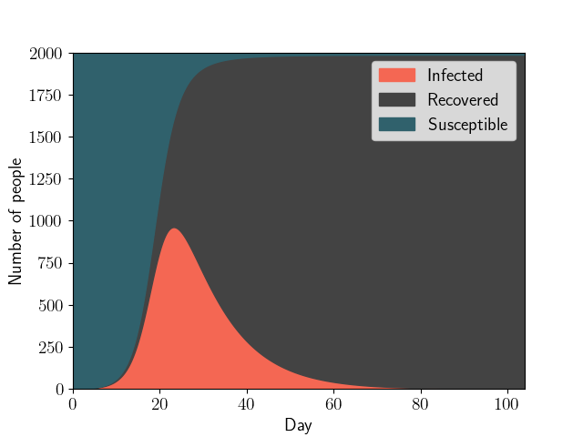

---

##### Links

- [Paper](https://github.com/kisnikser/Epidemic-Spread-Models/blob/main/paper.pdf)
- [Code](https://github.com/kisnikser/Epidemic-Spread-Models)
- [Slides](https://github.com/kisnikser/Epidemic-Spread-Models/blob/main/slides.pdf)

---

##### Abstract

Various approaches to modeling the spread of epidemics, differential equations and Markov processes.

---

##### Figure 1: Overview

