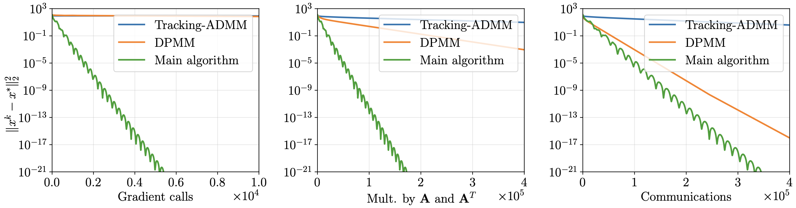

---

##### Links

+ [arXiv](https://arxiv.org/abs/2407.02020) 

---

##### Abstract

We consider the decentralized minimization of a separable objective $\sum_{i=1}^{n} f_i(x_i)$, where the variables are coupled through an affine constraint $\sum_{i=1}^n\left(A_i x_i - b_i\right) = 0$. We assume that the functions $f_i$, matrices $A_i$, and vectors $b_i$ are stored locally by the nodes of a computational network, and that the functions $f_i$ are smooth and strongly convex.

This problem has significant applications in resource allocation and systems control and can also arise in distributed machine learning. We propose lower complexity bounds for decentralized optimization problems with coupled constraints and a first-order algorithm achieving the lower bounds. To the best of our knowledge, our method is also the first linearly convergent first-order decentralized algorithm for problems with general affine coupled constraints.

---

##### Figure 1: Comparison



<!-- ---

##### Citation

```BibTeX
@article{dorin2024forecastingfmriimages,
  author = {Dorin, Daniil and Kiselev, Nikita and Grabovoy, Andrey and Strijov, Vadim},
  journal = {Health Information Science and Systems},
  number = {1},
  pages = {55},
  title = {Forecasting fMRI images from video sequences: linear model analysis},
  volume = {12},
  year = {2024}
}
``` -->

<!-- ---

##### Related material

+ [Presentation slides](presentation1.pdf)
+ [Summary of the paper](https://www.penguinrandomhouse.com/books/110403/unusual-uses-for-olive-oil-by-alexander-mccall-smith/) -->
