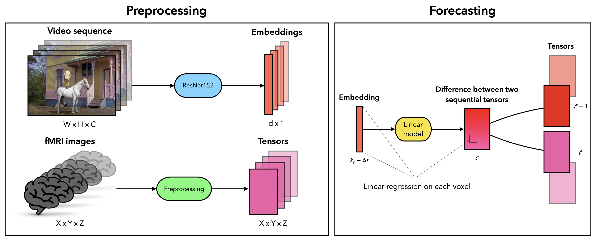

---

##### Links

+ [Paper](https://rdcu.be/d0oV0)
+ [Code](https://github.com/DorinDaniil/Forecasting-fMRI-Images)
+ [Video](https://www.youtube.com/live/WnIRaRl730A?si=Txo-uVvyS6JaTzRT&t=4305)
+ [Poster](https://github.com/DorinDaniil/Forecasting-fMRI-Images/blob/main/poster/poster.pdf)

---

##### Abstract

Over the past few decades, a variety of significant scientific breakthroughs have been achieved in the fields of brain encoding and decoding using the functional magnetic resonance imaging (fMRI). Many studies have been conducted on the topic of human brain reaction to visual stimuli. However, the relationship between fMRI images and video sequences viewed by humans remains complex and is often studied using large transformer models. In this paper, we investigate the correlation between videos presented to participants during an experiment and the resulting fMRI images. To achieve this, we propose a method for creating a linear model that predicts changes in fMRI signals based on video sequence images. A linear model is constructed for each individual voxel in the fMRI image, assuming that the image sequence follows a Markov property. Through the comprehensive qualitative experiments, we demonstrate the relationship between the two time series. We hope that our findings contribute to a deeper understanding of the human brain’s reaction to external stimuli and provide a basis for future research in this area.

---

##### Figure 1: Method Overview



---

##### Citation

```BibTeX
@article{dorin2024forecastingfmriimages,
	author = {Dorin, Daniil and Kiselev, Nikita and Grabovoy, Andrey and Strijov, Vadim},
	journal = {Health Information Science and Systems},
	number = {1},
	pages = {55},
	title = {Forecasting fMRI images from video sequences: linear model analysis},
	volume = {12},
	year = {2024}
}
```

<!-- ---

##### Related material

+ [Presentation slides](presentation1.pdf)
+ [Summary of the paper](https://www.penguinrandomhouse.com/books/110403/unusual-uses-for-olive-oil-by-alexander-mccall-smith/) -->
