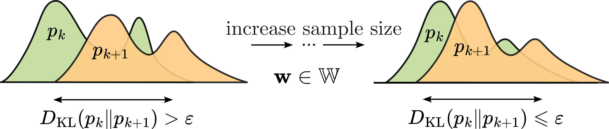

---

##### Links

+ [Paper](https://github.com/kisnikser/Likelihood-Bootstrapping/blob/main/paper/main.pdf) 
+ [Code](https://github.com/kisnikser/Likelihood-Bootstrapping)

---

##### Abstract

Determining an appropriate sample size is crucial for constructing efficient machine learning models. Existing techniques often lack rigorous theoretical justification or are tailored to specific statistical hypotheses about model parameters. This paper introduces two novel methods based on likelihood values from resampled subsets to address this challenge. We demonstrate the validity of one of these methods in a linear regression model. Computational experiments on both synthetic and real-world datasets show that the proposed functions converge as the sample size increases, highlighting the practical utility of our approach.

<!-- ---

##### Figure 1: Overview

 -->

<!-- ---

##### Citation

```BibTeX
@article{dorin2024forecastingfmriimages,
  author = {Dorin, Daniil and Kiselev, Nikita and Grabovoy, Andrey and Strijov, Vadim},
  journal = {Health Information Science and Systems},
  number = {1},
  pages = {55},
  title = {Forecasting fMRI images from video sequences: linear model analysis},
  volume = {12},
  year = {2024}
}
``` -->

<!-- ---

##### Related material

+ [Presentation slides](presentation1.pdf)
+ [Summary of the paper](https://www.penguinrandomhouse.com/books/110403/unusual-uses-for-olive-oil-by-alexander-mccall-smith/) -->
