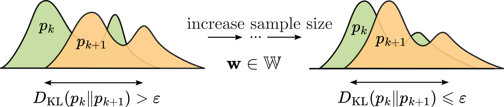

---

##### Links

+ [Paper](https://rdcu.be/d5x08) 
+ [Code](https://github.com/kisnikser/Posterior-Distributions-Proximity)
+ [Video](https://www.youtube.com/watch?v=WnIRaRl730A&t=1728s)

---

##### Abstract

The issue of sample size determination is crucial for constructing an effective machine learning model. However, the existing methods for determining a sufficient sample size are either not strictly proven, or relate to the specific statistical hypothesis about the distribution of model parameters. In this paper we present two approaches based on the proximity of posterior distributions of model parameters on similar subsamples. We show that these two methods are valid for the model with normal posterior distribution of parameters. Computational experiments demonstrate the convergence of the proposed functions as the sample size increases. We also compare the proposed methods with other approaches on different datasets.

---

##### Figure 1: Overview



---

##### Citation

```BibTeX
@article{dorin2024forecastingfmriimages,
  author = {Kiselev, Nikita and Grabovoy, Andrey},
  title = {Sample size determination: posterior distributions proximity},
  journal = {Health Information Science and Systems},
  year = {2025},
  volume = {22},
  number = {1},
  pages = {1}
}
```

<!-- ---

##### Related material

+ [Presentation slides](presentation1.pdf)
+ [Summary of the paper](https://www.penguinrandomhouse.com/books/110403/unusual-uses-for-olive-oil-by-alexander-mccall-smith/) -->
