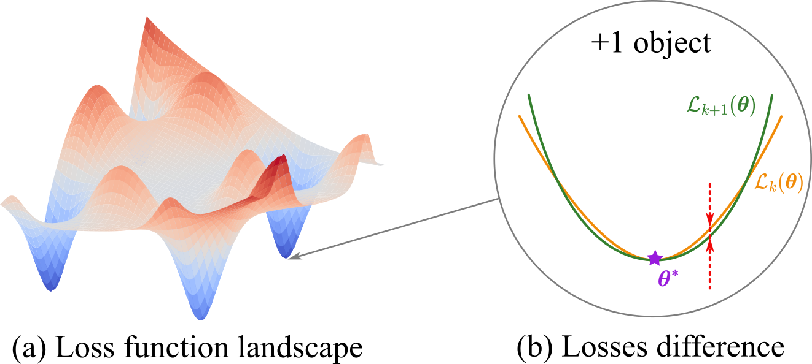

---

##### Links

- [Paper](https://github.com/kisnikser/landscape-hessian/blob/validation/paper/main.pdf)
- [Code](https://github.com/kisnikser/landscape-hessian/tree/validation)
- [Video](https://www.youtube.com/live/5br4xqTASf4?si=bcUVpGE-D2OK8Azr&t=1046)

---

##### Abstract

The loss landscape of neural networks is a critical aspect of their behavior, and understanding its properties is essential for improving their performance. In this paper, we investigate how the loss surface changes when the sample size increases, a previously unexplored issue. We theoretically analyze the convergence of the loss landscape in a fully connected neural network and derive upper bounds for the difference in loss function values when adding a new object to the sample. Our empirical study confirms these results on various datasets, demonstrating the convergence of the loss function surface for image classification tasks. Our findings provide insights into the local geometry of neural loss landscapes and have implications for the development of sample size determination techniques.

---

##### Figure 1: Overview

